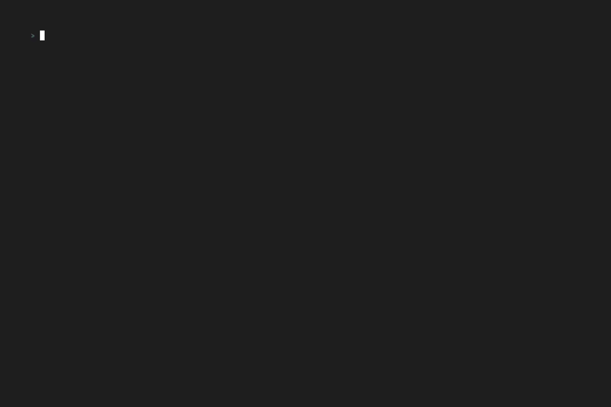
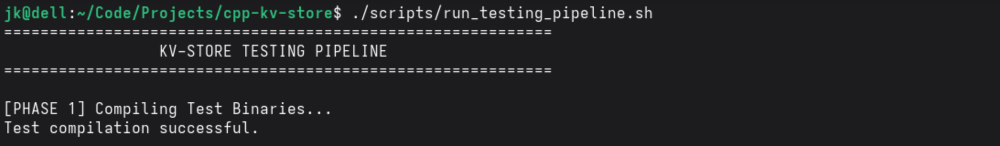
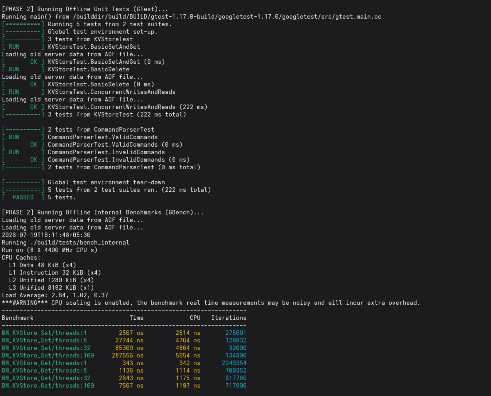
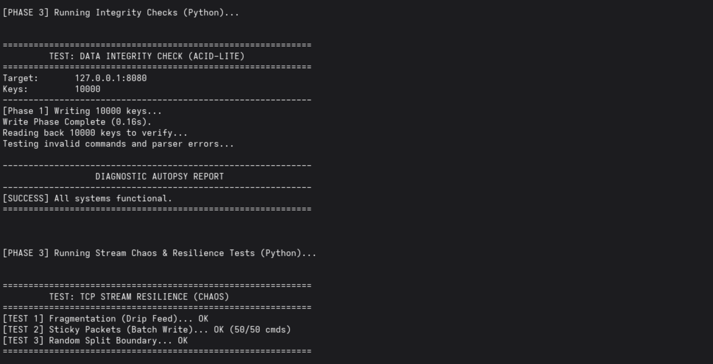
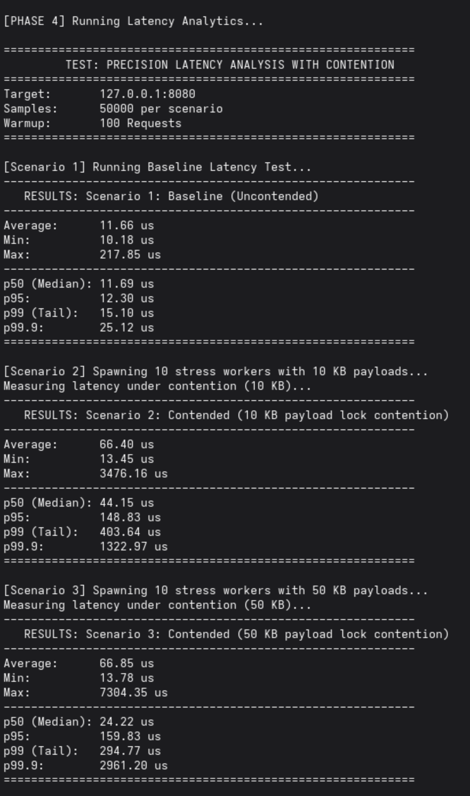
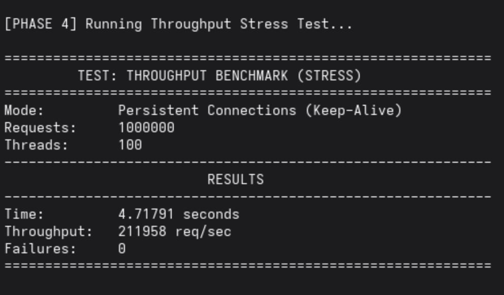
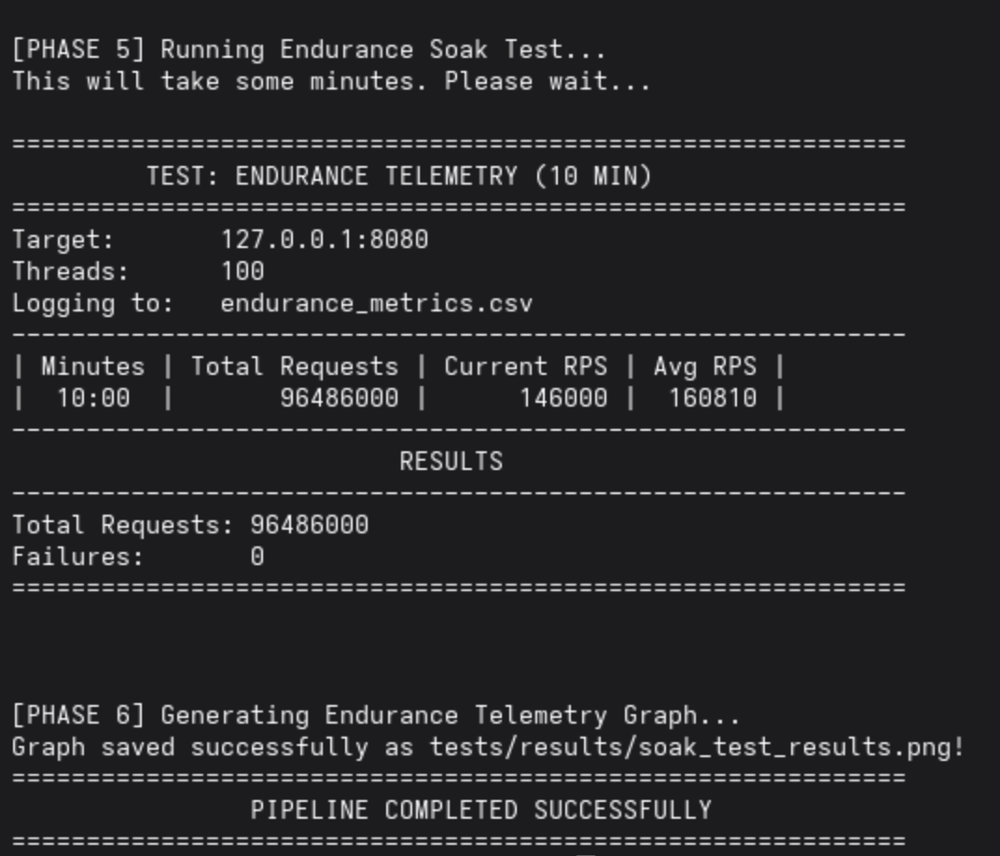

# C++ KV Store

A Key-Value store written in C++ with a TCP server interface.

## Overview

This repository contains a basic Key-Value (KV) store implementation, alongside a networking layer to expose it over TCP. It includes a custom command parser for processing client requests and a comprehensive suite of tests and benchmarks to verify correctness, endurance, latency, and resilience.

## Features Present

*   **In-Memory Storage Layer**: Basic key-value operations implemented in C++ (`KVStore`).
*   **TCP Server**: A custom networking layer (`TCPServer`) that listens for incoming client connections on port 8080.
*   **Command Parsing**: Text-based protocol parsing (`CommandParser`) for handling client commands.
*   **Data Persistence**: Append-Only File (AOF) mechanism to restore server data upon restart.
*   **Comprehensive Testing Suite**: Extensive C++ (GTest/GBenchmark) and Python scripts to test unit logic, network throughput, latency under contention, data integrity, and stream resilience.

## Repository Structure

*   `src/` & `include/`: Core source code and header files (`KVStore`, `TCPServer`, `CommandParser`).
*   `main.cpp`: Entry point for the server, setting up the TCP server and signal handlers for graceful shutdown.
*   `scripts/`: Bash scripts to automate building, cleaning, and running the testing pipeline. (See `scripts/README.md`)
*   `tests/`: Unit tests, benchmarks, chaos tests, and Python-based integrity checks. (See `tests/README.md`)
*   `demos/`: VHS tape scripts (`.tape`) for generating terminal recording GIFs/videos. (See `demos/README.md`)
*   `CMakeLists.txt`: Build configuration file.

## Getting Started

The project is built using CMake. Convenience scripts are provided to streamline the build and execution process. Please note that these `.sh` files contain multiple commands bundled together which run different tests and orchestration tasks.

**Important:** Before running the scripts, make sure to grant them executable permissions using `chmod +x`:
```bash
chmod +x scripts/*.sh
```

1.  **Run the Server**: 
    ```bash
    ./scripts/run_server.sh
    ```
    This script will configure the CMake build, compile the `kvstore` binary, and start the server on port 8080.

2.  **Run the Testing Pipeline**:
    ```bash
    ./scripts/run_testing_pipeline.sh
    ```
    This script executes a sequence of commands to run the full suite of unit tests, latency analytics, throughput stress tests, and endurance telemetry.

3.  **Clean the Setup**:
    ```bash
    ./scripts/clean_setup.sh
    ```
    Removes build artifacts and persistent data to start fresh.

## Demos and Walkthrough

The following demonstrations were generated using `vhs` and `.tape` files. Note that because they were recorded in a controlled environment running recording software, the testing numbers shown in the demos might differ from actual raw performance. You will achieve the best performance when running the server and tests natively on an unencumbered machine.

### Server Startup


### Testing Pipeline Demo


For the full test duration, please watch the full video located at: [`demos/gifs/demo_testing_video.mp4`](demos/gifs/demo_testing_video.mp4)

## Performance and Benchmark Results

The test suite (`run_testing_pipeline.sh`) includes detailed performance benchmarks. Below are the results obtained during a recent test run, alongside screenshots capturing each phase of the pipeline.

**Important Context Regarding Numbers:**
The specific numbers demonstrated below (e.g., ~211,958 req/sec) were recorded on a very specific setup:
*   **Processor**: Intel Core i5-11300H
*   **Operating System**: Fedora Linux
*   **Physical Setup**: Device plugged into wall power (charger connected) and placed on a cooling pad.

**Variance:** 
These metrics are purely contextual and **will change** on different machines, different Operating Systems, or varying system loads. They can also vary significantly due to thermal throttling, CPU scaling, or background tasks. The numbers should not be taken as absolute limits or guarantees, but rather as a snapshot of performance under those exact conditions.

### Phase 1: Compiling Test Binaries


### Phase 2: Unit Tests (GTest) & Internal Benchmarks (GBench)
All unit tests and internal benchmarks pass seamlessly.


### Phase 3: Data Integrity & Stream Chaos Tests
*   **Data Integrity Check (ACID-lite)**: 10,000 keys written and read back without errors.
*   **TCP Stream Resilience**: Successfully handled packet fragmentation, sticky packets (batch writes), and random split boundaries.


### Phase 4: Latency & Throughput Stress Tests
*   **Baseline Latency**: ~11.69 µs (p50), ~15.10 µs (p99)
*   **Contended Latency (10 KB)**: ~44.15 µs (p50)
*   **Throughput Benchmark**: **211,958 req/sec** over persistent connections with 100 threads.



### Phase 5 & 6: Endurance Soak Test (10 Min)
The server successfully handled over 96.4 million requests continuously over 10 minutes with **0 failures**, maintaining an average of ~160,810 RPS under sustained load.

